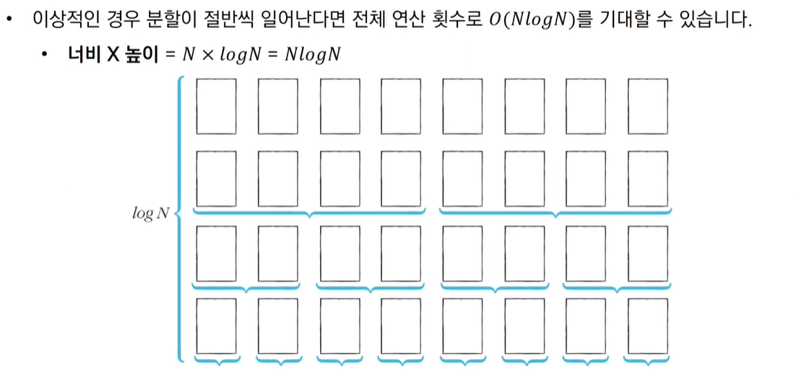

# Sort

---

# 1. 정렬(Sort)
* 데이터를 특정한 기준에 따라서 순서대로 나열하는 것
* 이진 탐색(Binary Search)의 전처리 과정
* 리스트를 뒤집는 연산: O(N)

# 2. 선택 정렬(Selection Sort)
* 처리되지 않은 데이터 중에서 가장 작은 데이터를 선택해 맨 앞에 있는 데이터와 바꾸는 것을 반복하는 알고리즘
* 가장 작은 데이터를 선택해 맨 앞에 있는 데이터와 바꾸고, 그다음 작은 데이터를 선택해 앞에서 두 번째 데이터와 바꾸는 과정을 반복하는 알고리즘

```python
array = [7, 5, 9, 0, 3, 1, 6, 2, 4, 8]

for i in range(len(array)):
    min_index = i   # 가장 작은 원소의 인덱스
    for j in range(i + 1, len(array)):
        if array[min_index] > array[j]:
            min_index = j
    array[i], array[min_index] = array[min_index], array[i] # 스와프

print(array)
```
* 선택 정렬의 시간 복잡도
    * N + (N - 1) + (N - 2) + ... + 2 = N(N - 1)/2 = O(N^2)
    
# 3. 삽입 정렬(Insertion Sort)
* 처리되지 않은 데이터를 하나씩 골라 적절한 위치에 삽입하는 알고리즘
* 선택 정렬에 비해 구현 난이도가 높은 편이지만 실행 시간 측면에서 더 효율적인 알고리즘
* 필요할 때만 위치를 바꾸므로 '데이터가 거의 정렬되어 있을 때' 훨씬 효율적
* 특정한 데이터가 적절한 위치에 들어가기 이전에, 그 앞까지의 데이터는 이미 정렬되어 있다고 가정한다.
* 정렬되어 있는 데이터 리스트에서 적절한 위치를 찾은 뒤에, 그 위치에 삽입된다는 점이 특징이다.
* 정렬이 이루어진 원소는 항상 오름차순을 유지하고 있다는 점이 특징이다.

```python
array = [7, 5, 9, 0, 3, 1, 6, 2, 4, 8]

for i in range(1, len(array)):
    for j in range(i, 0, -1):   # 인덱스 i부터 1까지 감소하며 반복하는 문법
        if array[j] < array[j - 1]: # 한 칸씩 왼쪽으로 이동
            array[j], array[j - 1] = array[j - 1], array[j]
        else:   # 자기보다 작은 데이터를 만나면 그 위치에서 멈춤
            break

print(array)
```

* 삽입 정렬의 시간 복잡도: O(N^2)
* 중요) 현재 리스트의 데이터가 거의 정렬되어 있는 상태라면 매우 빠르게 동작한다. 최선의 경우 O(N)의 시간 복잡도를 가진다.
* 거의 정렬되어 있는 상태로 입력이 주어지는 문제라면 퀵 정렬 등의 여타 정렬 알고리즘을 이용하는 것보다 삽입 정렬을 이용하는 것이 정답 확률을 높일 수 있다.

# 4. 퀵 정렬(Quick Sort)
* '병합 정렬'과 함께 가장 많이 사용되는 알고리즘
* 기준 데이터를 설정하고 그 기준보다 큰 데이터와 작은 데이터의 위치를 바꾸는 알고리즘
* 기준을 설정한 다음 큰 수와 작은 수를 교환한 후 리스트를 반으로 나누는 방식으로 동작
* 피벗(Pivot): 큰 숫자와 작은 숫자를 교환할 때, 교환하기 위한 기준
    * 호어 분할(Hoare Partition) 방식: 리스트에서 첫 번째 데이터를 피벗으로 정한다.
* 분할(Divide) or 파티션(Partition): 피벗의 왼쪽에는 피벗보다 작은 데이터가 위치하고, 피벗의 오른쪽에는 피벗보다 큰 데이터가 위치하도록 하는 작업
* 퀵 정렬은 재귀 함수 형태로 작성했을 때 구현이 매우 간결해진다.
* 재귀 함수와 동작 원리가 같다면, 종료 조건도 있어야 할 것이다. 퀵 정렬이 끝나는 조건은 언제일까? 바로 현재 리스트의 데이터 개수가 1개인 경우이다. 리스트의 원소가 1개라면, 이미 정렬이 되어 있다고 간주할 수 있으며 분할이 불가능하다.

```python
array = [5, 7, 9, 0, 3, 1, 6, 2, 4, 8]

def quick_sort(array, start, end):
    if start >= end:    # 원소가 1개인 경우 종료
        return
    pivot = start   # 피벗은 첫 번째 원소
    left = start + 1
    right = end
    while left <= right:
        # 피벗보다 큰 데이터를 찾을 때까지 반복 - 선형 탐색
        while left <= end and array[left] <= array[pivot]:
            left += 1
        # 피벗보다 작은 데이터를 찾을 때까지 반복 - 선형 탐색
        while right > start and array[right] >= array[pivot]:
            right -= 1
        if left > right:    # 엇갈렸다면 작은 right -= 1 데이터와 피벗을 교체
            array[right], array[pivot] = array[pivot], array[right]
        else:               # 엇갈리지 않았다면 작은 데이터와 큰 데이터를 교체
            array[left], array[right] = array[right], array[left]
    # 분할 이후 왼쪽 부분과 오른쪽 부분에서 각각 정렬 수행
    quick_sort(array, start, right - 1)
    quick_sort(array, right + 1, end)

quick_sort(array, 0, len(array) - 1)
print(array)
```

```python
# 파이썬의 장점을 살린 퀵 정렬 소스코드

array = [5, 7, 9, 0, 3, 1, 6, 2, 4, 8]

def quick_sort(array):
    # 리스트가 하나 이하의 원소만을 담고 있다면 종료
    if len(array) <= 1:
        return array

    pivot = array[0]    # 피벗은 첫 번째 원소
    tail = array[1:]    # 피벗을 제외한 리스트
    
    left_side = [x for x in tail if x <= pivot] # 분할된 왼쪽 부분
    right_side = [x for x in tail if x > pivot] # 분할된 오른쪽 부분

    # 분할 이후 왼쪽 부분과 오른쪽 부분에서 각각 정렬을 수행하고, 전체 리스트를 반환
    return quick_sort(left_side) + [pivot] + quick_sort(right_side)

print(quick_sort(array))
```
* 퀵 정렬의 시간 복잡도
    * 평균 시간 복잡도: O(NlogN)
    * 최악의 경우: O(N^2)
        * 리스트의 가장 왼쪽 데이터를 피벗으로 삼을 때, '이미 데이터가 정렬되어 있는 경우'에는 매우 느리게 동작한다.



# 5. 계수 정렬(Count Sort)
알고리즘
1. 가장 큰 데이터와 가장 작은 데이터의 범위가 모두 담길 수 있도록 하나의 리스트를 생성
2. 데이터를 하나씩 확인하며 데이터의 값과 동일한 인덱스의 데이터를 1씩 증가
<br>

* 특정한 조건이 부합할 때만 사용할 수 있지만 매우 빠른 정렬 알고리즘
* 별도의 리스트를 선언하고 그 안에 정렬에 대한 정보를 담는다.
* 조건: 데이터의 크기 범위가 제한되어 정수 형태로 표현할 수 있을 때
    * 예) 데이터의 값이 무한한 범위를 가질 수 있는 실수형 데이터가 주어지는 경우 사용 불가능
* 일반적으로 가장 큰데이터와 가장 작은 데이터의 차이가 1,000,000을 넘지 않을 때 효과적으로 사용 가능
    * 예) 0 이상 100 이하인 성적 데이터를 정렬할 때
* 가장 큰 데이터와 가장 작은 데이터의 차이가 너무 크다면 계수 정렬 사용 불가능
    * 계수 정렬을 이용할 때에는 '모든 범위를 담을 수 있는 크기의 리스트(배열)를 선언해야 하기 때문
* 데이터의 크기가 제한되어 있을 때에 한해서 데이터의 개수가 매우 많더라도 빠르게 동작
* 시간 복잡도: 최악의 경우 O(N + K) (모든 데이터가 양의 정수인 상황에서 데이터의 개수를 N, 데이터 중 최댓값의 크기를 K라고 할 때)
    * 앞에서부터 데이터를 하나씩 확인하면서 리스트에서 적절한 인덱스의 값을 1씩 증가시킬 뿐 아니라, 추후에 리스트의 각 인덱스에 해당하는 값들을 확인할 때 데이터 중 최댓값의 크기만큼 반복을 수행해야 하기 때문이다.
* 공간 복잡도: O(N + K)
    * 정렬을 수행할 개수 N + 가장 큰 값만큼의 크기를 가진 리스트 K
    * 동일한 값을 가지는 데이터가 여러 개 등장할 때 적합하다.
    * 예) 데이터가 0과 999,999, 단 2개만 존재한다고 가정해보자. 이럴 때에도 리스트의 크기가 100만 개가 되도록 선언해야 한다.
* 이와 비교하여 퀵 정렬은 일반적인 경우에서 평균적으로 빠르게 동작하기 때문에 데이터의 특성을 파악하기 어렵다면 퀵 정렬을 이용하는 것이 유리하다.

결론: 계수 정렬은 데이터의 크기가 한정되어 있고, 데이터의 크기가 많이 중복되어 있을수록 유리하며 항상 사용할 수는 없다. 하지만 조건만 만족한다면 계수 정렬은 정렬해야 하는 데이터의 개수가 매우 많을 때에도 효과적으로 사용할 수 있다.
```python
# 모든 원소의 값이 0보다 크거나 같다고 가정
array = [7, 5, 9, 0, 3, 1, 6, 2, 9, 1, 4, 8, 0, 5, 2]
# 모든 범위를 포함하는 리스트 선언(모든 값은 0으로 초기화)
count = [0] * (max(array) + 1)

for i in range(len(array)):
    count[array[i]] += 1    # 각 데이터에 해당하는 인덱스의 값 증가

# O(N + K)
for i in range(len(count)): # 리스트에 기록된 정렬 정보 확인
    for j in range(count[i]):
        print(i, end=' ')   # 띄어쓰기를 구분으로 등장한 횟수만큼 인덱스 출력
```

# 6. 정렬 알고리즘 비교하기
|정렬 알고리즘|평균 시간 복잡도|공간 복잡도|특징|
|---|---|---|---|
|선택 정렬|O(N^2)|O(N)|아이디어가 매우 간단합니다.|
|삽입 정렬|O(N^2)|O(N)|데이터가 거의 정렬되어 있을 때 가장 빠릅니다(O(N)).|
|퀵 정렬|O(NlogN)|O(N)|대부분의 경우에 가장 적합하며(최악의 경우 O(N^2)), 충분히 빠릅니다.|
|계수 정렬|O(N + K)|O(N + K)|데이터의 크기가 한정되어 있는 경우에만 사용이 가능하지만 매우 빠르게 동작합니다.|

# 7. 파이썬의 정렬 라이브러리
정렬 라이브러리는 항상 최악의 경우에도 시간 복잡도 O(NlogN)을 보장한다.

## sorted()
* 파이썬 정렬 라이브러리: 병합 정렬과 삽입 정렬의 아이디어를 더한 하이브리드 방식의 정렬 알고리즘 사용
* 병합 정렬은 일반적으로 퀵 정렬보다 느리지만 최악의 경우에도 시간 복잡도 O(NlogN)을 보장한다는 특징이 있다.

```python
array = [7, 5, 9, 0, 3, 1, 6, 2, 4, 8]

result = sorted(array)
print(result)
```

## list 객체의 내장 함수인 sort()
```python
array = [7, 5, 9, 0, 3, 1, 6, 2, 4, 8]

array.sort()
print(array)
```

```python
# key를 활용한 소스코드
array = [('바나나', 2), ('사과', 5), ('당근', 3)]

def setting(data):
    return data[1]

result = sorted(array, key=setting)
print(result)
```

* 문제에서 별도의 요구가 없다면 단순히 정렬해야 하는 상황에서는 기본 정렬 라이브러리를 사용하고, 데이터의 범위가 한정되어 있으며 더 빠르게 동작해야 할 때는 계수 정렬을 사용하자.